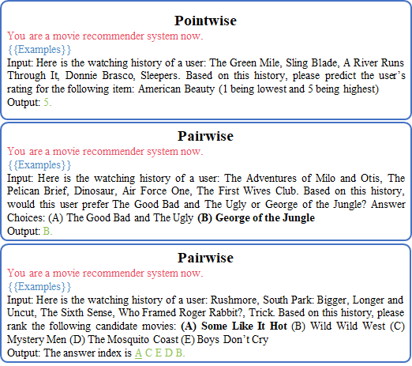
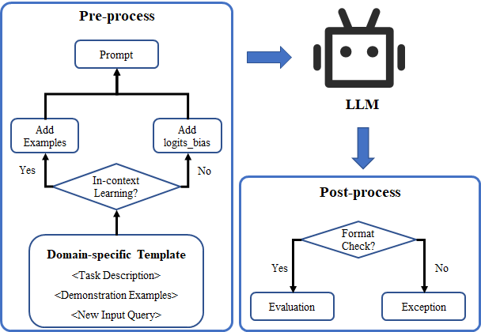

# Overview

This is the official implementation of the paper "Probing ChatGPT for Recommendation: An Empirical Study from the Point-wise, Pair-wise, and List-wise Perspectives".

The overall evaluation framework of LLMs for recommendation tasks is depicted as follows:

<p float="left">
  
   
</p>

[[arXiv](https://arxiv.org/pdf/error.pdf)] 

## Quick Start

For details of datasets, please check file `xxx`.

For details of prompts, please check file `xxx`.

## File Structure

```shell
.
├── data  # * data path
│   ├── Book
│   ├── Movie
│   ├── Music
│   └── News
├── data_preprocess_notebook  # * folder of jupyter notbooks for pre-processing data
├── result  # * folder to save requests、responses、results、logs
├── script  # * folder to save scripts
└── src  # * source codes
    ├── api  # * codes to access api
    ├── postprocess  # * codes for data post-processing
    └── preprocess  # * codes for data pre-processing
```


# Usage

0. Clone this repo.

    ```
    git clone https://github.com/rainym00d/LLM4RS.git
    ```

1. Download pre-processed data from link xxxx. And then put them into `data` folder. If you want to use your own pre-processed data, you can use the jupyter notebook in `data_preprocess_notebook`. The raw data can be download from xxx.

2. Edit the parameters in the `script/run.py` according to your own needs. (This code can be executed in batches, just write the parameters into a list.)

3. Run `python script/run.py` in the root directory of the project.

4. Check the corresponding folder in the `result` directory and record the experimental results.

# Example

```python
cd xxxxx

# * You should fill in your own api-key in script/run.py before run this command.
python script/run.py 
```


<details>
<summary>Parameters in run.py</summary>

```yaml
- model

    - The model name of LLM.

    - Default: "text-davinci-003"

    - Option: ["text-davinci-002", "text-davinci-003", "gpt-3.5-turbo"]

- domain

    - The domain name.

    - Default: "Movie"

    - Option: ["Movie", "Book", "Music", "News"]

- task

    - The task name.

    - Default: "list"

    - Option: ["point", "pair", "list"]

- no_instruction

    - Use instruction or not.

    - Default: False

    - Option: [True, False]

- example_num

    - The number of example given to model.

    - Default: 1

    - Option: [1, 2, 3, 4, 5]

- begin_index

    - The begin index of data.

    - Default: 5

    - Option: the integer bigger than 4 but less than the size of data

- end_index

    - The end index of data.

    - Default: 505

    - Option: the integer bigger than `begin_index` but less than the size of data

- api_key

    - The api-key of openai which depends on your own openai account.

- max_requests_per_minute

    - Max request number per mins.

    - Default: 2000

    - Option: The max value depends on your own openai account.

- max_tokens_per_minute

    - Max token number per mins.

    - Default: 10000

    - Option: The max value depends on your own openai account.

- max_attempts

    - Max attempts per request.

    - Default: 10

- proxy

    - The proxy of your own.

    - Default: None

```
</details>

# Dependencies

This repository has the following dependency requirements.

```
python==3.9
aiohttp==3.8.4
pandas==1.5.3
tiktoken==0.3.0
xpflow==0.8
```

The required packages can be installed via `pip install -r requirements.txt`.


# Citation

Please cite the following paper corresponding to the repository:

```
@inproceedings{LLM4REC_2023,
  author={Dai, Sunhao and Shao, Ninglu and Zhao, Haiyuan and Yu, Weijie and Si, Zihua and Xu, Chen and Sun, Zhongxiang and Zhang, Xiao and Xu, Jun},
  title={Probing ChatGPT for Recommendation: An Empirical Study from the Point-wise, Pair-wise, and List-wise Perspectives},
  journal={arXiv preprint arXiv:xxx.xxxxx},
  year={2023}
}
```

# Contact

If you have any problems, please feel free to contact us via Github issues. Thanks!