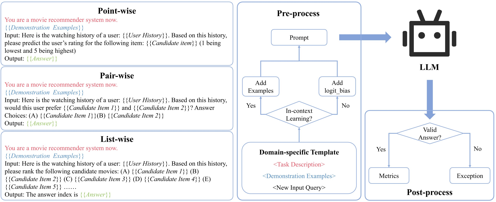
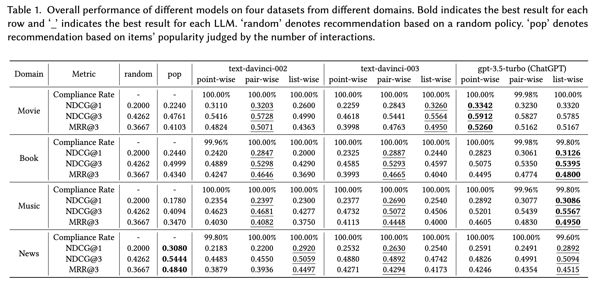

# Overview

This is the official implementation of the paper "*Uncovering ChatGPT's Capabilities in Recommender Systems*".

> ***Abstract:*** The debut of ChatGPT has recently attracted the attention of the natural language processing community and beyond. Existing studies have demonstrated that ChatGPT shows significant improvement in a range of downstream NLP tasks, but the capabilities and limitations of ChatGPT in terms of recommendations remain unclear. In this study, we aim to conduct an empirical analysis of ChatGPT's recommendation ability from an Information Retrieval (IR) perspective, including point-wise, pair-wise, and list-wise ranking. To achieve this goal, we re-formulate the above three recommendation policies into a domain-specific prompt format. Through extensive experiments on four datasets from different domains, we demonstrate that ChatGPT outperforms other large language models across all three ranking policies. Based on the analysis of unit cost improvements, we identify that ChatGPT with list-wise ranking achieves the best trade-off between cost and performance compared to point-wise and pair-wise ranking.Moreover, ChatGPT shows the potential for mitigating the cold start problem and interpretable recommendation.

The overall evaluation framework of LLMs for recommendation tasks is depicted as follows:

<div align=center>
   
</div>

The main result of different LLMs on four different domain datasets is presented as follows:

<div align=center>
   
</div>

[[arXiv](https://arxiv.org/pdf/error.pdf)] 

## Quick Start

- For details of datasets, please check file `data/readme.md`.

- For details of prompts, please check file `assets/prompts.pdf`.

- For detail of our result, please download from [here](https://drive.google.com/drive/folders/1rSvbnbSG_K-H4pPip8kao1UXFT9WiQ49?usp=sharing)

## File Structure

```shell
.
├── data  # * data path
│   ├── Book
│   ├── Movie
│   ├── Music
│   ├── News
│   └── preprocess  # * folder of jupyter notbooks for pre-processing original dataset
├── result  # * folder to save requests、responses、results、logs
├── script  # * folder to save scripts
└── src  # * source codes
    ├── api  # * codes to access api
    ├── postprocess  # * codes for data post-processing
    └── preprocess  # * codes for data pre-processing
```


# Usage

0. Clone this repo.

    ```
    git clone https://github.com/rainym00d/LLM4RS.git
    ```

1. Download pre-processed data from [here](https://drive.google.com/drive/folders/1DOoa01emz4NaSINBUWS05F_0xDjBmP_2). And then put them into `data` folder. (If you want to use your own data, you can refer to our preprocess code in `data/preprocess`.)

2. Edit the parameters in the `script/run.py` according to your own needs. (This code can be executed in batches, just write the parameters into a list.)

3. Run `python script/run.py` in the root directory of the project.

4. Check the corresponding folder in the `result` directory and record the experimental results.

# Example

```shell
git clone https://github.com/rainym00d/LLM4RS.git

cd LLM4RS

# * You should fill in your own api-key in script/run.py before run this command.
python script/run.py 
```


<details>
<summary>Parameters in run.py</summary>

```yaml
- model

    - The model name of LLM.

    - Default: "text-davinci-003"

    - Option: ["text-davinci-002", "text-davinci-003", "gpt-3.5-turbo"]

- domain

    - The domain name.

    - Default: "Movie"

    - Option: ["Movie", "Book", "Music", "News"]

- task

    - The task name.

    - Default: "list"

    - Option: ["point", "pair", "list"]

- no_instruction

    - Use instruction or not.

    - Default: False

    - Option: [True, False]

- example_num

    - The number of example given to model.

    - Default: 1

    - Option: [1, 2, 3, 4, 5]

- begin_index

    - The begin index of data.

    - Default: 5

    - Option: the integer bigger than 4 but less than the size of data

- end_index

    - The end index of data.

    - Default: 505

    - Option: the integer bigger than `begin_index` but less than the size of data

- api_key

    - The api-key of openai which depends on your own openai account.

- max_requests_per_minute

    - Max request number per mins.

    - Default: 2000

    - Option: The max value depends on your own openai account.

- max_tokens_per_minute

    - Max token number per mins.

    - Default: 10000

    - Option: The max value depends on your own openai account.

- max_attempts

    - Max attempts per request.

    - Default: 10

- proxy

    - The proxy of your own.

    - Default: None

```
</details>

# Dependencies

This repository has the following dependency requirements.

```
python==3.9
aiohttp==3.8.4
pandas==1.5.3
tiktoken==0.3.0
xpflow==0.8
```

The required packages can be installed via `pip install -r requirements.txt`.


# Citation
If you find our code or work useful for your research, please cite our work.

```
@inproceedings{LLM4REC_2023,
  author={Dai, Sunhao and Shao, Ninglu and Zhao, Haiyuan and Yu, Weijie and Si, Zihua and Xu, Chen and Sun, Zhongxiang and Zhang, Xiao and Xu, Jun},
  title={Uncovering ChatGPT's Capabilities in Recommender Systems},
  journal={arXiv preprint arXiv:xxx.xxxxx},
  year={2023}
}
```

# Contact

If you have any problems, please feel free to contact us via Github issues. Thanks!
